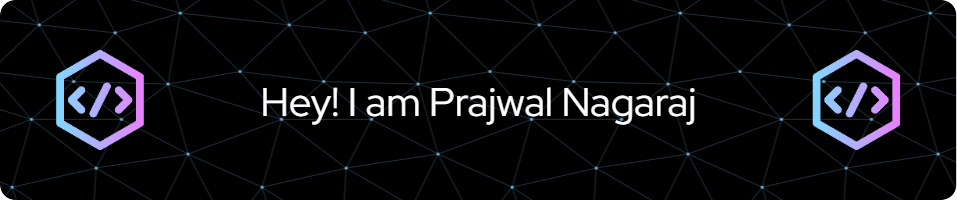

### Hi there 👋

Welcome to my GitHub profile! 🚀 

## About Me ℹ️
I'm Prajwal Nagaraj, a Business Analyst entusiast and a experienced Quality Assurance professional with a passion for leveraging data analytics to drive business insights and optimize processes. 

## Quick Overview 🌟

- 🎓 Expected Graduation: April 2025
- 💼 Seeking an internship or any opportunity to expand my knowledge in data analytics or a related field. I am eager to apply my skills and gain hands-on experience.
- 📧 Reach me at: 

## Top Repositories

## IDE

## Skills 🛠️

- Quality Assurance: Manual Testing, Automation Testing (Selenium, Cucumber)
- Data Analysis: Python, SQL, Tableau, Power BI
- Tools: MS Office, JIRA, Confluence, GitHub

## Projects 🚧

### Intelligent Packaging Solution for Safe and Secured Delivery

- Developed a packaging model for eCommerce companies to ensure safe and secure product delivery.
- Recognized with the best paper award from the International Journal of Advanced Research in Science, Communication, and Technology (IJARSCT).

## Experience 💼

### Accenture Solutions Pvt Ltd

- Quality Engineer (Oct. 2021 - Aug. 2023)
  - Conducted functional, regression, and integration testing.
  - Collaborated with cross-functional teams to ensure quality integration throughout SDLC.

### VI Solutions

- Intern (Jul. 2020 - Aug. 2020)
  - Explored Embedded Software Programming and Industrial IoT.

## Let's Connect! 🌐

- 💬 Feel free to reach out for collaboration or just to say hi!
- 👉 [LinkedIn](https://linkedin.com/in/prajwal-nagaraj)
